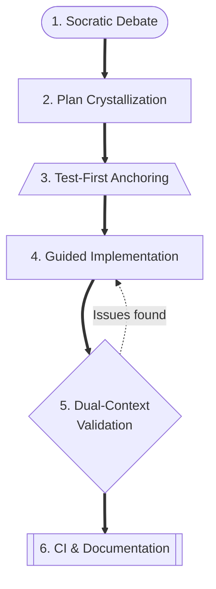
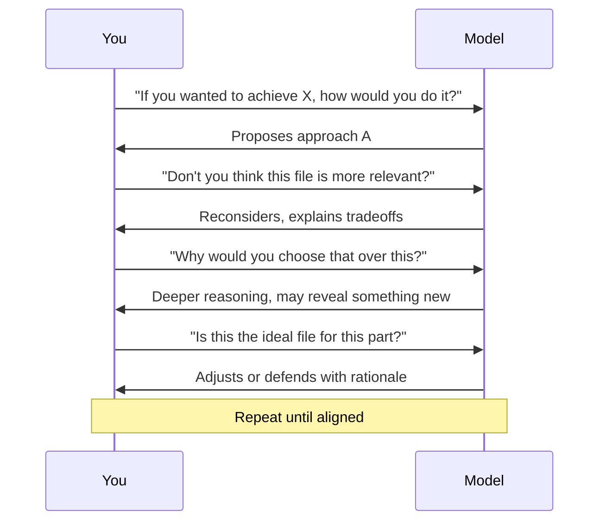
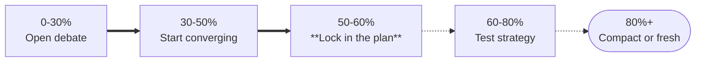
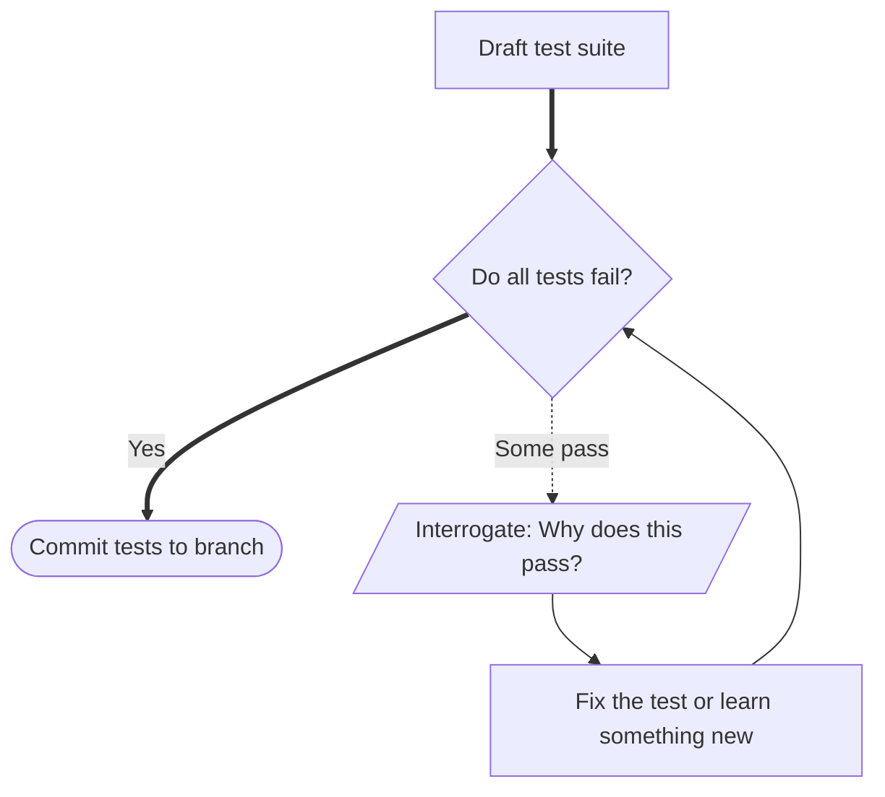
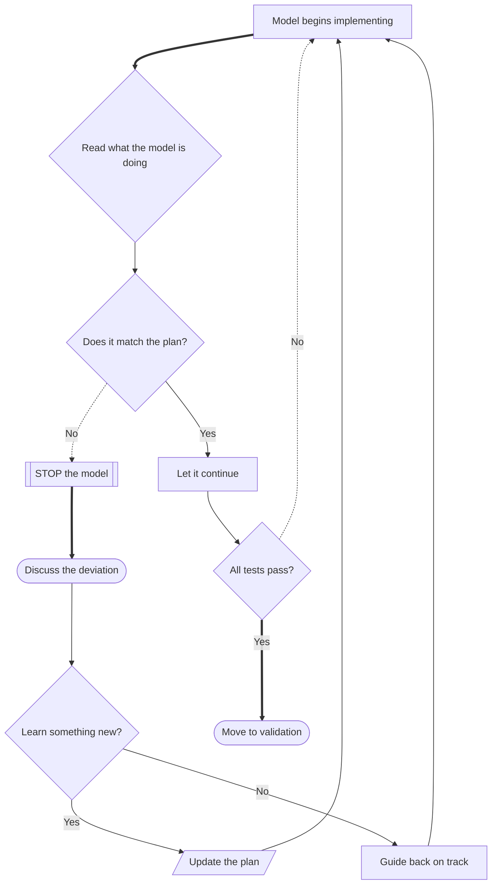
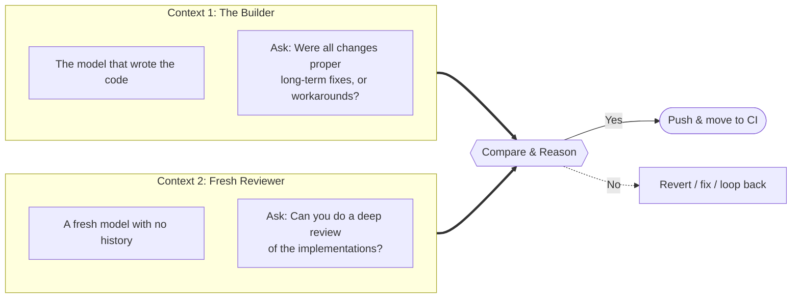
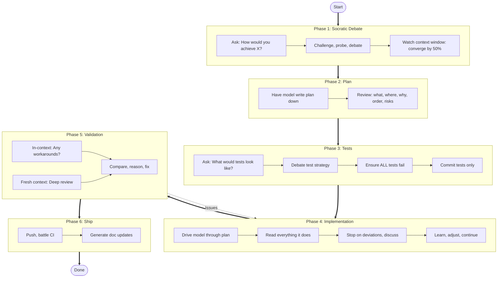

# The Socratic Prompt Method: How to Actually Learn While Coding with AI

Every model demo you've ever watched follows the same script. Someone from Anthropic, OpenAI, or whoever types a prompt, the model produces something impressive, and the audience applauds. Type a request, get code back, ship it. That's the workflow the entire industry is teaching you -- and it's a slot machine with a syntax highlighter.

Naturally, that's how I started using these tools too. I saw the demos, I mimicked the pattern. Type, generate, accept, repeat. The code worked -- mostly. But I noticed something uncomfortable: I wasn't learning anything. I was outsourcing my thinking to a machine and rubber-stamping the output.

Then it hit me -- those demos are optimized for *showcasing the model*, not for making you a better engineer. The demo format is a terrible workflow. It trains you to be passive. So I started doing the opposite of what the demos show. Instead of prompting and accepting, I started questioning and debating. Deliberately, methodically, like a teacher who already knows the answer but wants the student to find it.

<!-- more -->

What emerged is something I now call the **Socratic Prompt Method**: a workflow that turned my AI-assisted development from passive code generation into the most effective learning process I've ever experienced. The key insight: **don't tell the model what to do. Interrogate it until you're both aligned, then hold it accountable with tests.** What follows isn't prompt engineering tricks -- it's the full development methodology I use every day, and it's made me a significantly better engineer in the process.

## The Full Workflow at a Glance

Let me walk you through each phase -- and share the mistakes that taught me why each one matters.

---

## Phase 1: The Socratic Debate

This is the phase that changed everything for me. The instinct when you sit down with an AI assistant is to start giving instructions. I had to train myself out of that.

Instead, I open with a question:

> "If you want to achieve [insert specs], how would you do it?"

Here's the thing -- I usually already know how I'd do it. That's the whole point. I'm not asking because I'm lost. I'm asking to **see the gap** between the model's reasoning and mine. And sometimes that gap reveals that *I'm* the one who's wrong.

### The Art of the Socratic Question

I've found certain types of questions consistently produce the best conversations. Here's what I reach for:

| Question Type | Example | What It Reveals |
|---|---|---|
| **Challenge the location** | "Is this the ideal file for this?" | Whether the model understands your architecture |
| **Challenge the approach** | "Why would you choose X over Y?" | Depth of reasoning, awareness of tradeoffs |
| **Introduce relevant context** | "Don't you think this file is relevant?" | Whether the model missed key dependencies |
| **Probe assumptions** | "What happens when Z is null here?" | Edge cases and robustness of thinking |

The key is to *lead* the model to the correction rather than just stating it. I know it sounds slower, but this is where I've had my biggest "aha" moments. More than once, the model has pushed back on my suggestion and been *right* -- and I learned something I wouldn't have if I'd just dictated instructions.

### Watch Your Context Window

One lesson I learned the hard way: the Socratic debate is high-value but token-expensive. You have to pace yourself.

I aim to be transitioning from debate to plan by the time I hit 50-60% context consumption. Early on I'd burn through my entire context on a fascinating tangent and then have nothing left for the actual plan. Don't make that mistake -- the debate is a means, not the end.

---

## Phase 2: Plan Crystallization

Once we're aligned, I tell the model to **write the plan down**. Not optional. A plan sitting in the context is a persistent reference point that keeps both of us honest.

I look for the plan to capture:

- **What** changes are being made and **where**
- **Why** this approach was chosen (the debate should have surfaced this)
- **What order** things should be implemented
- **What the key risks** are

I also learned that a written plan survives context compaction much better than a sprawling conversation. When the context inevitably gets compressed, the plan is your anchor.

---

## Phase 3: Test-First Anchoring

This phase is where the method gets its teeth -- and honestly, where I had the biggest mindset shift.

Before any implementation, I have the model draft tests:

> "What would a test suite look like for this plan?"

Then we debate the test strategy. I push back on coverage gaps, question assumptions, probe edge cases. If this debate spills into the next context window, that's fine -- once a draft of the tests exists in the codebase, you can compact and keep refining.

### The Critical Rule: All Tests Must Fail

This tripped me up the first few times. **Every test must fail before you start implementing.** If a test passes when no implementation exists, something is wrong:

- The test might be trivially true (testing nothing)
- The test might be hitting existing behavior you didn't know about
- The test might have a bug that makes it always pass

When this happens, I interrogate the model: "Why does this test pass? Shouldn't it fail given that we haven't implemented anything yet?" This has genuinely taught me things about my own codebase that I didn't know. The model might say "well, actually, this behavior already exists in module X" -- and suddenly I understand my system better.

Once all tests fail and align with the plan, I commit **just the tests** as a PR. This is the contract. Everything from here is about making those tests green.

---

## Phase 4: Guided Implementation

Now I drive the model through the plan. But here's the rule I had to drill into myself: **you are not a passenger.**

### Don't Slot Machine It

I cannot stress this enough. When the model does something unexpected:

**STOP. Don't just let it run and hope it figures it out.**

I used to do this all the time. The model would start going off-plan and I'd think "maybe it sees something I don't." Sometimes it does -- but you won't know unless you ask. Every deviation is a conversation:

- "Why did you change this file? That wasn't in the plan."
- "This approach differs from what we discussed. What changed?"
- "Walk me through your reasoning for this specific change."

Here's what makes this phase actually enjoyable: you have your tests as a safety net. They define "done." So you're free to **explore**. Get off track a little. Play with the model's understanding. Challenge your own. I've had sessions where a deviation from the plan led to a 20-minute tangent that taught me more about the problem domain than the original task. That's not wasted time -- that's growth. And it's actually fun, because you know the tests are waiting to pull you back to reality whenever you're ready.

When you're done exploring, guide the model back to the plan -- or update the plan based on what you just learned.

### Context Window Strategy for Implementation

Don't worry about context consumption here. Your tests are committed -- they survive any context reset. If you run out of context, just start fresh:

> "Here's the plan: [plan]. Here are the failing tests: [test file]. Continue implementing."

---

## Phase 5: Dual-Context Validation

All tests pass. Time to validate -- and this is the trick I'm most proud of.

I use **two separate contexts** to cross-examine the work:

### Why Two Contexts?

I realized through experience that the model which wrote the code has a kind of **sunk cost bias baked into its context**. It spent a whole session building something -- it's going to tend to defend its decisions. A fresh context has no such bias. It'll catch things the original context rationalizes away.

In the **in-context model** (the one that wrote the code), I ask:

> "Were all the changes you made the proper long-term fix, or were there any workarounds?"

This leverages the model's full history. It *knows* where it cut corners because it was there when the decision happened. It's surprisingly honest when you ask directly.

In the **fresh context model**, I ask:

> "Can you do a deep review of the implementations in this branch?"

This gives you an unbiased second opinion. The fresh model judges the code purely on its merits, with no memory of the compromises made along the way.

I compare what both models say and look for disagreements. Those disagreements are exactly the spots that need attention. I'll roll back to any prior state as needed and loop until I'm satisfied with the branch.

---

## Phase 6: CI and Documentation

Push everything and battle CI failures. CI is the final arbiter -- if it fails, fix it. No shortcuts, no "it works on my machine."

For documentation, I use the model as an analyst after the PR is green:

> "Can you analyze the changes in this branch and investigate all the locations in documentation that need updating, and make those improvements?"

This works well as a separate pass. The model can see the full diff and trace its impact across the codebase -- it's often better at finding stale docs than I am.

---

## The Complete Flow

---

## Why This Works

Looking back, the Socratic Prompt Method works because of three things:

### 1. You Stay in the Driver's Seat

The model is a collaborator, not an autopilot. You're interrogating, guiding, and learning at every step. You understand every line of code that gets committed because you were present for every decision. There's no "I don't know what this does but the AI wrote it" -- you were part of the conversation that produced it.

### 2. Tests Are the Contract

By committing tests first, you create an objective definition of "done" that survives context resets, model hallucinations, and your own changing understanding. The tests don't care about the conversation -- they care about behavior. This is the anchor that makes everything else possible.

### 3. Every Interaction Is a Learning Opportunity

This is the core philosophy, and the reason I keep coming back to this method. Most AI workflows optimize for speed. This one optimizes for **understanding**. The Socratic questioning, the test interrogation, the dual-context review -- they all create moments where you learn something you didn't know before.

The result isn't just shipped code. It's shipped code you understand, validated from multiple angles, backed by a test suite you debated into existence. And you come out the other side a stronger engineer than when you started.

That's the real return on investment. The slot machine approach is faster per-session, sure. But this compounds. Every session makes you sharper, every debate deepens your intuition, and over time, you become the kind of engineer who doesn't need the AI to think for you -- you need it to think *with* you.

---

## Quick Reference Card

| Phase | Key Action | Key Question |
|---|---|---|
| 1. Debate | Challenge the model's approach | "If you wanted to achieve X, how would you do it?" |
| 2. Plan | Write it down | "Put the plan down now." |
| 3. Tests | Ensure all fail | "What would a test suite look like for this plan?" |
| 4. Implement | Stop on deviations | "Why did you deviate from the plan?" |
| 5. Validate | Two contexts, cross-examine | "Were any of these changes workarounds?" |
| 6. Ship | CI + docs | "What documentation needs updating?" |
